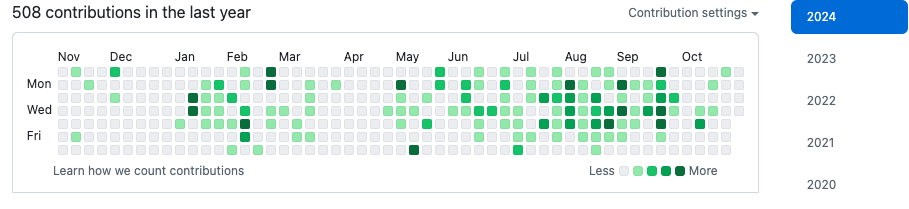

<h1 align="center"> Hi! I'm Roshdy 👋</h1>

    Software Engineer and Product Manager.
     
    I spend my time building side projects and trying out new platforms.
    I develop projects and write about them.
     
     
    Committed to ongoing learning and professional development,  
    I have a particular focus on system design, continuous integration, and product management.

<h2 align="left"> Projects </h2>
<table>
    <thead>
        <tr>
            <th>Project Name</th>
            <th>Description</th>
            <th>Articles</th>
        </tr>
    </thead>
    <tbody>
        <tr>
            <td>
                <a href="https://github.com/ibrahimroshdy/refresher">
                    Refresher
                </a>
            </td>
            <td>
                A robust infrastructure incorporating various technologies to streamline complex tasks.
            </td>
            <td>
                <a href="https://medium.com/dev-genius/refresher-project-a-glimpse-of-system-design-and-architecture-aaef28510dd4">
                    Article 1
                </a>, 
                <a href="https://medium.com/dev-genius/refresher-project-part-2-explaining-how-to-build-a-simple-infrastructure-with-django-celery-ddf7a797c791">
                    Article 2
                </a>
            </td>
        </tr>
        <tr>
            <td>
                <a href="https://github.com/ibrahimroshdy/continuous_integration">
                    Multi-Arch Build with GitHub Actions
                </a>
            </td>
            <td>
                Demonstrates implementing multi-architecture builds using GitHub Actions, workflows, and job configurations.
            </td>
            <td>
                <a href="https://blog.devgenius.io/continuous-integration-github-1130217cc2e9">
                    Article 1
                </a>, 
                <a href="https://blog.devgenius.io/how-to-build-your-docker-images-using-multi-arch-to-support-arm64-m1-macbook-6ebc42a47cd7">
                    Article 2
                </a>
            </td>
        </tr>
    </tbody>
</table>
<h2 align="left"> Tech Stack </h2>

    <h4 align="left">Languages/DB</h4>
    

        
        
        <!--  -->
        
    

    <h4 align="left">Git & DevOps</h4>
    

        
        
        
        
        
        
    

    <h4 align="left">Frameworks</h4>
    

        
        
        <!--  -->
        
        
        
        
        
        
         
    

<h2 align="lef"> Contact me </h2>

    
    

